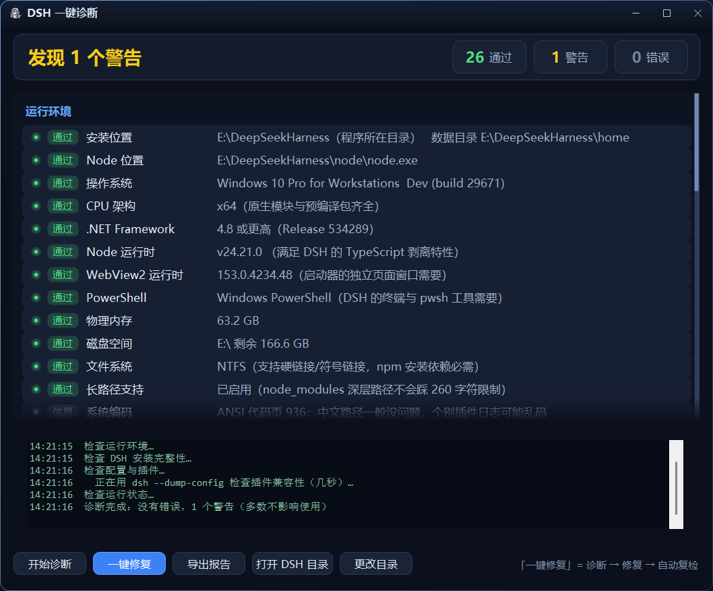
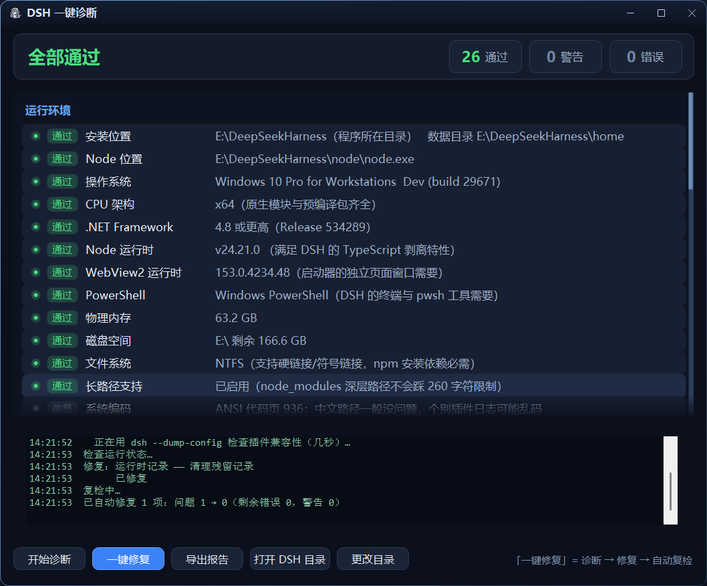

# DSH 一键诊断

> DeepSeek Harness 起不来、插件加载失败、页面打不开的时候，双击它 —— 自己查出病因，能修的顺手修好，再复检一遍告诉你结果。

适用于 Windows 上的 DeepSeek Harness 本地安装。单文件、无第三方依赖（.NET Framework 4.8 系统自带）、下载即可运行。

## 界面

诊断出问题：



点「一键修复」跑完闭环（警告 1 → 0）：



## 特性

- **近 30 项检查**，分四组：运行环境 / 安装完整性 / 配置与插件 / 运行状态
- **诊断 → 修复 → 复检** 完整闭环，点一下跑完，也支持命令行无人值守
- **路径全靠自动探测**，不写死安装位置；找不到时可手动指定
- **每个修复动作做完都会验证**（文件真的删了吗、目录真的空了吗、注册表真的写进去了吗），失败如实报告，不谎报成功
- **删除操作有路径边界校验**，目标必须严格位于预期目录内，杜绝误删
- 深色自绘界面、卡片式结果列表、可导出 txt 报告
- 退出码规范（0 / 1 / 2），方便写进批处理

## 快速开始

### 方式一：直接用（推荐）

下载后把 `DSH一键诊断.exe` 放到哪都行（放进 DSH 安装目录它会自己认出来），双击运行。

界面打开后会自动开始诊断。看到问题就点 **「一键修复」** —— 它会自己跑完 `诊断 → 修复 → 复检`，最后把「问题 3 → 0」写给你看。

### 方式二：自己编译

需要 .NET Framework 4.8（Win10/11 自带）和 `csc.exe`，没有任何第三方依赖：

```
双击  一键编译.bat
```

它会编译，把 exe 直接生成在**本文件夹根目录**，然后跑一次自检。也可以手动执行 `build.ps1`。

## 用法

### 命令行

| 命令 | 说明 |
|---|---|
| `DSH一键诊断.exe` | 打开界面并自动诊断 |
| `DSH一键诊断.exe --autofix` | 打开界面，直接跑「诊断 → 修复 → 复检」闭环 |
| `DSH一键诊断.exe --auto` | 无界面诊断，报告写到 exe 同目录的 `DSH诊断报告.txt` |
| `DSH一键诊断.exe --auto --fix` | 无界面诊断 + 自动修复 + 复检 |
| `--root <路径>` | 指定 DSH 安装目录（跳过自动探测）|
| `--home <路径>` | 指定 DSH_HOME |
| `--node <路径>` | 指定 node.exe |
| `--dsh <路径>` | 指定 dsh 的 bin.js |

示例：

```bat
DSH一键诊断.exe --auto --fix --root "D:\MyDSH"
```

### 退出码

| 码 | 含义 |
|---|---|
| 0 | 全部通过 |
| 1 | 有警告（多数不影响使用）|
| 2 | 有错误 |

## 它检查什么

| 分组 | 检查项 |
|---|---|
| **运行环境** | 安装位置、Node 位置、操作系统、CPU 架构、.NET Framework、Node 运行时、WebView2 运行时、PowerShell、物理内存、磁盘空间、文件系统、长路径支持、系统编码、系统代理 |
| **安装完整性** | DSH 主程序、依赖完整性、启动自检（`dsh --version`）、安装目录可写、DSH_HOME 可写、DSH_HOME 环境变量、npm 脚本策略 |
| **配置与插件** | profile 清单、用户 patch、兼容性豁免、插件兼容性、配置解析（`--dump-config`）、启动器组件 |
| **运行状态** | 服务端口、node 进程、多实例检测、运行时记录、启动日志、日志体积、窗口缓存、npm 缓存 |

检查项会随环境增减（比如某个目录不存在，对应的检查就不出现）。

## 它能自动修什么

| 问题 | 修复动作 |
|---|---|
| 残留的 `runtime.json`（指向已死进程）| 删除 |
| `compatibility.json` 损坏 | 删除损坏文件（有插件被跳过时会重新写豁免）|
| profile 的 `package.json` 损坏 | 从 `.bak-diag-*` 备份恢复 |
| `cordis.patch.yml` 丢失 | 从备份恢复 |
| 插件因版本声明不兼容被跳过 | 写**精确版本豁免**（不改 profile，删掉那行即撤销）|
| 依赖缺失、`dsh --version` 失败 | 跑 `npm install` 按 package.json 补齐（耗时几分钟）|
| 启动日志过大 | 清空（DSH 下次启动会重写）|
| 页面窗口缓存过大 | 清理 |
| npm 缓存过大 | 清理（下次更新会重新下载）|
| 启动器缺 WebView2 组件 | 从 `launcher-src\lib` 补齐 |
| 长路径支持未启用 | 写注册表（需要管理员权限才会成功）|
| `DSH_HOME` 环境变量与实际不符 | 改为正确值（用 `--root` 指定目录时只提示、不动系统变量）|

**修不了、只告诉你原因的**：端口被别的程序占用、Node 版本过低、磁盘或内存不足、安装目录权限问题、文件被占用。

## 通用性：路径全靠自动探测

这是个通用工具，不假设你装在哪儿。启动时按顺序探测，并把结果作为第一项检查显示出来。

**安装目录**（含 `dsh` / `node` / `home` 的那一层）

1. 命令行 `--root <路径>`
2. 程序自身所在目录，以及它的上级目录
3. 环境变量 `DSH_ROOT` / `DSH_INSTALL` / `DSH_DIR`
4. 由 `DSH_HOME` 反推
5. 常见位置：`?:\DeepSeekHarness`、`?:\DSH`、`?:\Program Files\DeepSeekHarness`、`%LOCALAPPDATA%\DeepSeekHarness`、`%USERPROFILE%\DeepSeekHarness`（盘符 C~G 都扫）
6. 扫各盘根目录，找名字含 `dsh` / `harness` 且结构像安装目录的

**数据目录**：`--home` → `<安装目录>\home` → 环境变量 `DSH_HOME` → `%USERPROFILE%\.dsh`

**Node**：`--node` → `<安装目录>\node\node.exe` → `PATH` → `%ProgramFiles%\nodejs\node.exe`

**DSH 主程序**：`--dsh` → `<安装目录>\dsh\node_modules\@deepseek-ai\dsh\lib\bin.js` → npm 全局目录 → npx 缓存

界面上点 **「更改目录」** 可以随时手动指定，程序会重新探测并立刻重跑一次诊断。探测来源（"程序所在目录" / "环境变量 DSH_ROOT" / "扫描磁盘发现"…）会写在结果里，方便排查为什么没找到。

## 可靠性加固

工具本身也可能出错，所以做了这些兜底，都有实测：

| 加固 | 说明 |
|---|---|
| **路径边界防护** | 任何删除/清空动作前先确认目标**严格位于**预期目录内部（连"等于基目录本身"都拒绝），路径异常时直接不执行 |
| **单实例互斥** | 界面版只允许开一个；再开会自动把已有窗口叫到前面然后安静退出。`--auto` 脚本模式不受限制 |
| **崩溃兜底** | 未处理异常写入 `DSH诊断工具-错误日志.txt`，不会静默消失；`--auto` 模式不弹窗（免得卡住脚本）|
| **分组隔离** | 四大检查组各自独立，某组出错会在列表里写明原因，其余检查照常跑完 |
| **修复后验证** | 每个修复动作都验证真实结果再报成功，不通过就如实报失败 |
| **数据目录跟随** | `--root` 指定安装目录时，数据目录取 `<root>\home`，避免"诊断 A 却去读 B 的会话/缓存" |

**已知行为**：诊断会更新目标目录的 LastWriteTime（可写性测试需要创建再删除一个临时文件）。

## 报告长什么样

```
DSH 一键诊断报告   2026-09-29 14:20:51
计算机：HFRIN-LAPTOP   用户：hf071
安装目录：E:\DeepSeekHarness
结果：自动修复 1 项，问题 1 → 0（错误 0，警告 0）
========================================

【运行环境】
[通过] 安装位置 : E:\DeepSeekHarness（程序所在目录）   数据目录 E:\DeepSeekHarness\home
[通过] Node 位置 : E:\DeepSeekHarness\node\node.exe
[通过] 操作系统 : Windows 10 Pro for Workstations (build 29671)
...

========================================
过程日志：
14:20:45  开始诊断…
14:20:47  修复：运行时记录 —— 清理残留记录
14:20:47       已修复
14:20:47  复检中…
14:20:48  已自动修复 1 项：问题 1 → 0
```

## 常见问题

**提示「没有探测到 DSH 安装目录」？**
用 `--root <路径>` 指定，或界面点「更改目录」。指定的那一层应该同时含 `dsh`、`node`、`home`。

**修复会不会改坏我的配置？**
改任何配置前都会留 `.bak-diag-时间戳` 备份。插件不兼容优先写豁免而不是删插件。所有删除都在路径边界校验之后执行。

**能修「DSH 起不来」吗？**
先跑一次诊断看报告。常见能自动修的：依赖缺失、配置损坏、缓存/日志过大。端口被占用这类只能告诉你是谁占的。

**杀软报毒？**
单文件 .NET 程序 + 无代码签名，容易被启发式误报。加白名单即可，源码就在仓库里。

**会不会误删东西？**
所有删除动作都要求目标**严格位于**预期目录内部（比如 npm 缓存必须在安装目录里），删完还会验证。这条有专门的实测用例。

## 编译环境

- Windows 10 / 11
- .NET Framework 4.8（系统自带）
- `C:\Windows\Microsoft.NET\Framework64\v4.0.30319\csc.exe`
- 无任何 NuGet 依赖，单文件源码

## 项目结构

```
doctor-src/
├─ DSH一键诊断.exe          编译好的成品，下载解压就在这儿（双击即用）
├─ 一键编译.bat             双击 = 重新编译 + 自检
├─ build.ps1                编译脚本
├─ DSH诊断报告.txt          --auto 模式生成的报告（运行时产生）
├─ DshDoctor.cs             全部源码（单文件）
├─ app.manifest             DPI 感知声明（高分屏不糊）
├─ app.ico                  图标
├─ docs/                    界面截图
├─ CHANGELOG.md             更新日志
└─ LICENSE                  MIT
```

## 许可证

MIT © 2026 HFRin
